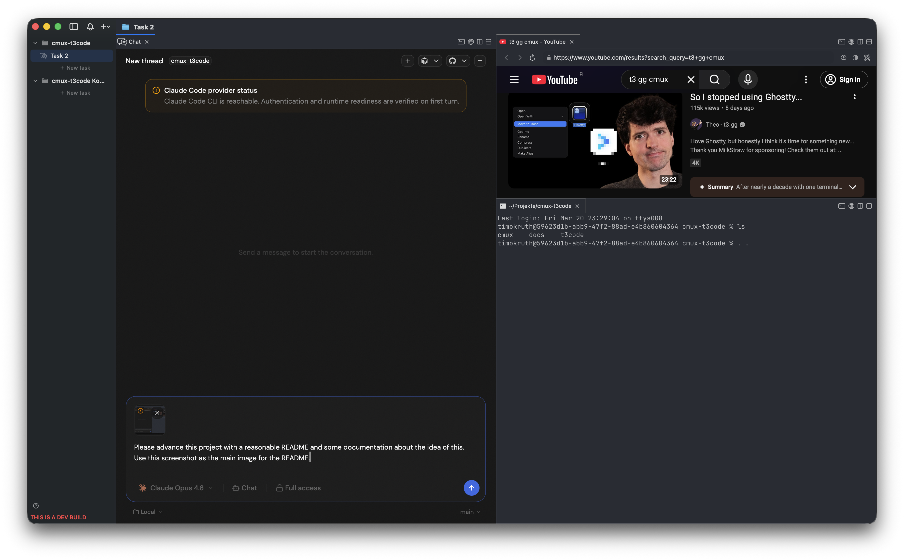

<h1 align="center">cmux + t3code</h1>
<p align="center">A proof-of-concept for integrating web-based AI tools into a native macOS terminal</p>

<p align="center">
  
</p>

## Goals

This superproject has two goals:

1. **Showcase how to integrate web-based tools into cmux.** The cmux side is modified to spawn a sidecar Node.js server per workspace and embed its UI in a native panel -- demonstrating the pattern for any web-based tool, not just t3code.

2. **Adopt t3code's project-workspace model into cmux.** t3code organizes work around projects with per-project threads and state. This PoC brings that concept into cmux as first-class "task" workspaces -- each with its own chat panel, project directory, and isolated t3code instance -- while keeping t3code itself essentially unmodified.

The design principle: adjust t3code as little as possible (ideally zero changes) and do all the integration work on the cmux side.

## What is what?

- **[cmux](https://github.com/manaflow-ai/cmux)** -- A macOS terminal built on Ghostty with vertical tabs, split panes, notification rings, and an in-app browser. Designed for running multiple AI coding agents side by side.
- **[t3code](https://github.com/pingdotgg/t3code)** -- A minimal web GUI for coding agents (Claude, Codex, and more). Provides a chat interface for interacting with AI assistants in the context of your project.

When combined, every project you open in cmux automatically gets its own t3code sidecar server. Each workspace tab has a built-in chat panel connected to a dedicated t3code instance -- no external setup, no browser tabs, no context switching.

## How it works

```
cmux-t3code.app
  |
  +-- Workspace: my-project/
  |     +-- Terminal pane (Ghostty)
  |     +-- Chat pane (t3code on port 57236)
  |     +-- Browser pane
  |
  +-- Workspace: other-project/
  |     +-- Terminal pane (Ghostty)
  |     +-- Chat pane (t3code on port 57237)
  |
  ...each workspace gets its own t3code sidecar process
```

## Quick start

### Prerequisites

- macOS 14+
- Xcode 16+ (with command-line tools)
- [Bun](https://bun.sh/) (`brew install oven-sh/bun/bun`) or Node.js 22+

### Install

```bash
# Clone with submodules
git clone --recursive <repo-url> cmux-t3code
cd cmux-t3code

# Setup cmux (builds GhosttyKit framework)
cd cmux && ./scripts/setup.sh && cd ..

# Build t3code + cmux and install to /Applications
cd cmux && ./scripts/install-cmux-t3code.sh
```

Then launch:

```bash
open /Applications/cmux-t3code.app
```

### Rebuilding after changes

```bash
cd cmux-t3code/t3code && bun run build && cd ..
cd cmux && ./scripts/install-cmux-t3code.sh
```

## Project structure

```
cmux-t3code/
  cmux/       # macOS terminal app (git submodule)
  t3code/     # AI coding assistant server (git submodule)
  INSTALL.md  # Detailed installation guide (bundled & standalone options)
```

## Documentation

See [INSTALL.md](./INSTALL.md) for the full installation guide including standalone mode, manual step-by-step setup, troubleshooting, and server binary resolution details.

## License

Each submodule retains its own license. See [cmux/LICENSE](./cmux/LICENSE) and [t3code/LICENSE](./t3code/LICENSE).
